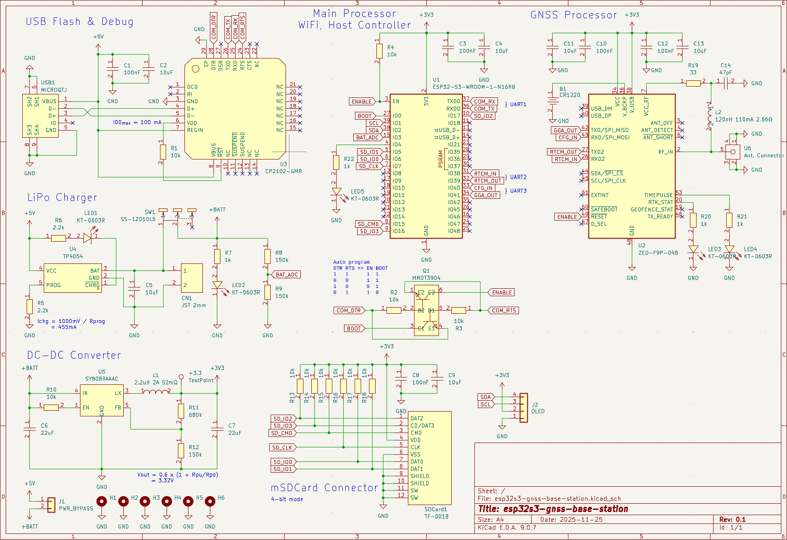
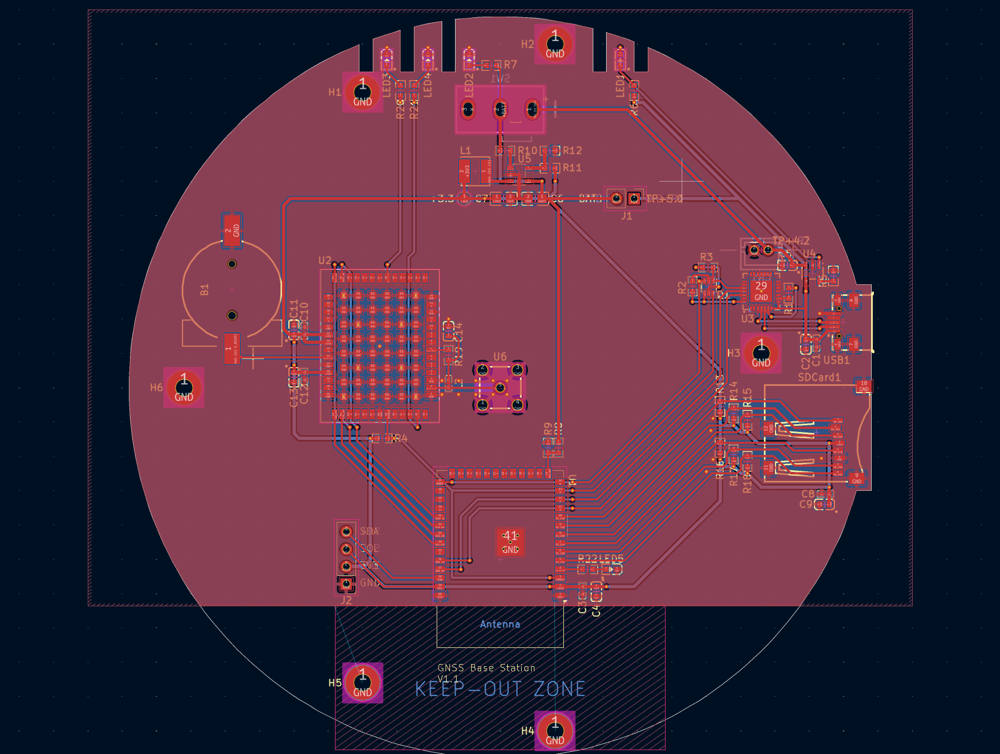
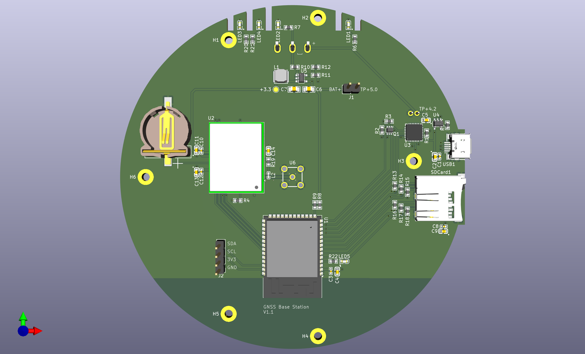
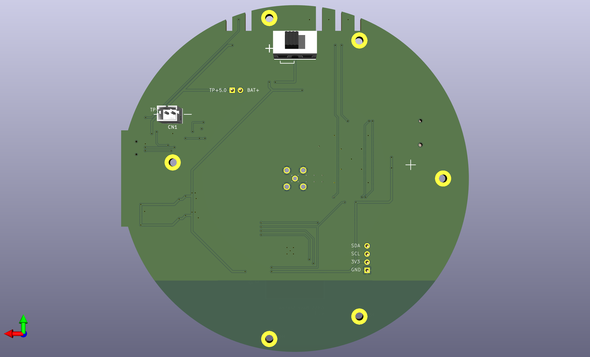

# RTK GNSS Base Station using ESP32-S3 and Ublox ZED-F9P

Design and build a RTK GNSS Base Station to provide precise positioning service, which sends RTCM messages over a self-hosted NTRIP web server or an external Radio module, supports micro SD Card storage for post-processing purposes.

This project is developed on top of [ESP32-S3-WROOM-1-N16R8](https://documentation.espressif.com/esp32-s3-wroom-1_wroom-1u_datasheet_en.pdf), with below specifications:

- Xtensa® dual-core 32-bit LX7 microprocessor with single precision FPU, up to 240 MHz
- 384 KB ROM
- 512 KB SRAM + 16 KB SRAM in RTC
- Embedded 8 MB PSRAM (Octal SPI), up to 80 MHz
- Integrated 16 MB Flash (Quad SPI), up to 80 MHz
- 2.4 GHz Wi-Fi (802.11b/g/n, STA/AP/STA+AP, 150 Mbps) and Bluetooth 5 (BLE, Mesh, 2 Mbps)
- SPI, LCD interface, Camera interface, UART, I2C, I2S, remote control, pulse counter, LED PWM, full-speed USB 2.0 OTG, USB Serial/JTAG controller, MCPWM, SD/MMC host controller, GDMA, TWAI® controller (compatible with ISO 11898-1), ADC, touch sensor,temperature sensor, timers and watchdogs
- 36 GPIOs

## Hardware

### Design Tools

Install **KiCad**:

```sh
sudo add-apt-repository ppa:kicad/kicad-9.0-releases
sudo apt update
sudo apt install kicad
```

Extensions:

- Parts from Espressif: <https://github.com/espressif/kicad-libraries>
- Parts from JLCPCB: <https://github.com/CDFER/JLCPCB-Kicad-Library>
- PCB Export to JLCPCB: <https://github.com/Bouni/kicad-jlcpcb-tools>
- PCB RF tools: <https://github.com/easyw/RF-tools-KiCAD>

Parts:

- JLCPCB Parts: <https://jlcpcb.com/parts/> which mainly is from LCSC Parts: <https://www.lcsc.com/>

  - Search for **Stock Type = In Stock** and **Parts Type = Basic | Promotional Extended** and **PCBA Type = Economic**

  - Use `easyeda2kicad` to download symbols, footprints and 3D models from LCSC to KiCAD:

    <details>

    <https://github.com/enduity/easyeda2kicad>>

    Install:

    ``` sh
    cd hardware
    git clone https://github.com/enduity/easyeda2kicad
    cd easyeda2kicad
    python3 -m venv .venv
    source .venv/bin/activate
    pip install .
    ```

    Go back to the hardware project folder, create `libs` folder:

    ```sh
    cd ..
    mkdir -p libs
    ```

    Then download parts from LCSC, for example, ESP32-S3-WROOM-1-N16R8 has LCSCID=C2913202:

    ```sh esp32-s3-gnss-base-station/hardware (.venv)
    easyeda2kicad --lcsc_id C2913202 --full --output ./libs/LCSC --project-relative
    ```

    Add the LCSC libs into KiCAD projects:

    - Goto `Preferences` > `Manage Symbol Libraries`, in Project Specific Libs, add `${KIPRJMOD}/libs/LCSC.kicad_sym`
    - Goto `Preferences` > `Manage Footprint Libraries`, in Project Specific Libs, add `${KIPRJMOD}/libs/LCSC.pretty`

    </details>

### Schematic

**Components**:

| Part                                                                                 | Link                                                                     |
| ------------------------------------------------------------------------------------ | ------------------------------------------------------------------------ |
| Espressif WiFi Module ESP32-S3-WROOM-1-N16R8                                         | <https://jlcpcb.com/partdetail/3198300-ESP32_S3_WROOM_1N16R8/C2913202>   |
| U-blox GNSS Receiver ZED-F9P-04B                                                     | <https://jlcpcb.com/partdetail/UBLOX-ZED_F9P04B/C5120257>                |
| ShouHan Female Micro-B Connector MicroQTJ                                            | <https://jlcpcb.com/partdetail/SHOUHAN-MicroQTJ/C404968>                 |
| SOFNG MicroSD Card Push-Push Connector TF001B                                        | <https://jlcpcb.com/partdetail/SOFNG-TF001B/C125617>                     |
| XKB 125V 3A SPDT Slide Switch SS-12D10L5                                             | <https://jlcpcb.com/partdetail/XKBConnection-SS12D10L5/C319012>          |
| SILICON LABS 3.3V 20mA 1Mbps USB 2.0 Transceiver CP2102-GMR                          | <https://jlcpcb.com/partdetail/SKYWORKS_SILICONLABS-CP2102GMR/C6568>     |
| TOPPOWER 4.2V 450mA 1-Cell Lithium Battery Charger TP4054-42-SOT25R                  | <https://jlcpcb.com/partdetail/33539-TP4054_42SOT25R/C32574>             |
| Silergy Corp 2.7-5.5V 2A Adjustable Buck DC Converter SY8089AAAC                     | <https://jlcpcb.com/partdetail/SilergyCorp-SY8089AAAC/C78988>            |
| Hongjiacheng 2-NPN SOT-363 Bipolar MMDT3904                                          | <https://jlcpcb.com/partdetail/hongjiacheng-MMDT3904/C41375125>          |
| JST 1x2P 2mm Connector B2B-PH-K-S(LF)(SN)                                            | <https://jlcpcb.com/partdetail/JST-B2B_PH_K_S_LF_SN/C131337>             |
| UNI-ROYAL(Uniroyal Elec) 100mW 33Ω 75V 0603 SMD 0603WAF330JT5E                       | <https://jlcpcb.com/partdetail/23867-0603WAF330JT5E/C23140>              |
| UNI-ROYAL(Uniroyal Elec) 100mW 1kΩ 75V 0603 SMD 0603WAF1001T5E                       | <https://jlcpcb.com/partdetail/21904-0603WAF1001T5E/C21190>              |
| UNI-ROYAL(Uniroyal Elec) 100mW 2.2kΩ 75V 0603 SMD 0603WAF2201T5E                     | <https://jlcpcb.com/partdetail/4597-0603WAF2201T5E/C4190>                |
| UNI-ROYAL(Uniroyal Elec) 100mW 10kΩ 75V 0603 SMD 0603WAF1002T5E                      | <https://jlcpcb.com/partdetail/26547-0603WAF1002T5E/C25804>              |
| UNI-ROYAL(Uniroyal Elec) 100mW 150kΩ 75V 0603 SMD 0603WAF1503T5E                     | <https://jlcpcb.com/partdetail/23534-0603WAF1503T5E/C22807>              |
| UNI-ROYAL(Uniroyal Elec) 100mW 680kΩ 75V 0603 SMD 0603WAF6803T5E                     | <https://jlcpcb.com/partdetail/26565-0603WAF6803T5E/C25822>              |
| Samsung Electro-Mechanics 100nF 16V X7R ±10% 0402 Ceramic Capacitors CL05B104KO5NNNC | <https://jlcpcb.com/partdetail/1877-CL05B104KO5NNNC/C1525>               |
| Samsung Electro-Mechanics 10uF 25V X5R ±20% 0603 Ceramic Capacitors CL10A106MA8NRNC  | <https://jlcpcb.com/partdetail/97651-CL10A106MA8NRNC/C96446>             |
| Samsung Electro-Mechanics 22uF 25V X5R ±20% 0805 Ceramic Capacitors CL21A226MAQNNNE  | <https://jlcpcb.com/partdetail/46786-CL21A226MAQNNNE/C45783>             |
| Samsung Electro-Mechanics 47pF 50V C0G ±5% 0603 Ceramic Capacitors CL10C470JB8NNNC   | <https://jlcpcb.com/partdetail/2023-CL10C470JB8NNNC/C1671>               |
| Hubei KENTO Elec 2.4V 20mA 300mcd 40mW 645nm Red Water Clear 0603 LED                | <https://jlcpcb.com/partdetail/Hubei_KENTOElec-KT0603R/C2286>            |
| Sunlord 2.2uH 2A 52mΩ ±20% SMD 4x4mm Power Inductors SWPA4026S2R2MT                  | <https://jlcpcb.com/partdetail/Sunlord-SWPA4026S2R2MT/C96891>            |
| Murata Electronics 110mA 120nH 2.66Ω ±5% 0402 Power Inductors LQW15ANR12J00D         | <https://jlcpcb.com/partdetail/MurataElectronics-LQW15ANR12J00D/C113123> |
| Q&J CR1220 SMD Button And Strip Battery Connector CR1220-2                           | <https://jlcpcb.com/partdetail/QJ-CR12202/C70381>                        |
| BAT WIRELESS 50Ω 6GHz SMB Female Connectors BWSMB-KE                                 | <https://jlcpcb.com/partdetail/BATWIRELESS-BWSMBKE/C5250063>             |

**Schematic**



### PCB Layout

Layers:

- Front Copper: Signal
- Inner 1: GND
- Inner 2: GND
- Back Copper: Signal

RF Path:

- In ZED-F9P Integration manual, it mentions that RF input should ensure RF trace is tuned for 50 Ω to ensure adequate bandwidth and power matching
- Board will be made by JLCPCB, refer their guidance at <https://jlcpcb.com/help/article/User-Guide-to-the-JLCPCB-Impedance-Calculator> to get the trace width, details in [RF Impedance Calculator](hardware/impedance_calculator.png)

PCB Layout:



The rendered images:

<div style="display: flex; gap: 16px;">
  <div style="flex: 1;">
    
  </div>
  <div style="flex: 1;">
    
  </div>
</div>

The final board:

<div style="display: flex; gap: 16px;">
  <div style="flex: 1;">
    
  </div>
  <div style="flex: 1;">
    
  </div>
</div>

------------------------------------------------------------

## Firmware

### Development Tools

- IDE: Visual Studio Code + ESP-IDF Extenstion
- Framework: ESP-IDF for ESP32-S3

### ESP-IDF

Install EIM:

``` sh
echo "deb [trusted=yes] https://dl.espressif.com/dl/eim/apt/ stable main" | sudo tee /etc/apt/sources.list.d/espressif.list
sudo apt update
sudo apt install eim
```

Install ESP-IDF SDK from EIM:

- Install latest STABLE version, at the moment, it is 6.0.2. The online document for ESP32-S3 is at <https://docs.espressif.com/projects/esp-idf/en/v6.0.2/esp32s3/index.html>
- Use default settings

Add OpenOCD udev rules:

``` sh
find ~/.espressif -type f -name "*.rules" -exec sudo cp -v {} /etc/udev/rules.d/ \;
sudo udevadm control --reload-rules
sudo udevadm trigger
```
